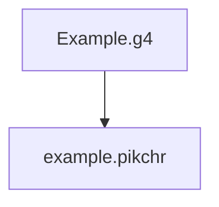

### Description

It takes a configuration file written in a specific format used by an open source tool to generate a reader that understands machine-readable codes as specified in the provided configuration file, and converts that provided configuration file into another format where a second open source tool is able to render as a visualisation, hence helping coders to learn how to write those machine-readable codes.

### Goal

Takes in any Antlr4 grammar file in, and generates Pikchr outputs.

It's visually helpful and attractive for potential users to understand and use a language.



For instance:


### Examples

1. [Antlr4 grammar examples](https://github.com/antlr/grammars-v4)
1. [Pikchr examples](https://pikchr.org/home/doc/trunk/doc/examples.md)

### Usage

CAUTION: lexer rules must be removed first. (Need fix this)

##### Step 0: Build Pikchr command line tool

(See [Pikchr/Downloads](https://pikchr.org/home/doc/trunk/doc/download.md))

```bash
$ git clone https://github.com/drhsqlite/pikchr
$ cd pikchr
$ gcc -DPIKCHR_SHELL -o pikchr pikchr.c -lm # build the pikchr command-line tool
```

##### Step 1: Run pikca4

```bash
$ python main.py -h

usage: g4 To pikchr [-h] [-g GRAMMAR] [-op OUTPUTPIKCHR] [-os OUTPUTSVG]

optional arguments:
  -h, --help            show this help message and exit
  -g GRAMMAR, --grammar GRAMMAR
                        path of the g4 grammer file
  -op OUTPUTPIKCHR, --OutputPikchr OUTPUTPIKCHR
                        pikchr file folder path
  -os OUTPUTSVG, --OutputSVG OUTPUTSVG
                        svg file folder path
# Example: *.pikchr files will be generated in `generated` at the project root dir
$ python src/main.py -g SQLiteParser.g4
```

##### Step 2: Run Pikchr command line tool

```bash
$ pikchr
usage: pikchr [OPTIONS] FILE ...
Convert Pikchr input files into SVG.  Filename "-" means stdin.
Options:
   --dont-stop      Process all files even if earlier files have errors
   --svg-only       Omit raw SVG without the HTML wrapper
```
