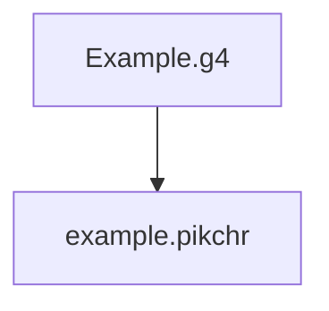

### Goal
Takes in any Antlr4 grammar file in, and generates Pikchr outputs.

It's visually helpful and attractive for potential users to understand and use a language.

### Examples
1. [Antlr4 grammar examples](https://github.com/antlr/grammars-v4)
1. [Pikchr examples](https://pikchr.org/home/doc/trunk/doc/examples.md)