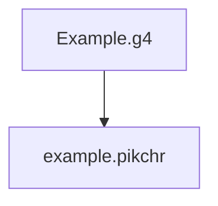

### Goal

Takes in any Antlr4 grammar file in, and generates Pikchr outputs.

It's visually helpful and attractive for potential users to understand and use a language.



For instance:


### Examples

1. [Antlr4 grammar examples](https://github.com/antlr/grammars-v4)
1. [Pikchr examples](https://pikchr.org/home/doc/trunk/doc/examples.md)

### Usage

##### Step 0: Build Pikchr command line tool

(See [Pikchr/Downloads](https://pikchr.org/home/doc/trunk/doc/download.md))

```bash
$ git clone https://github.com/drhsqlite/pikchr
$ cd pikchr
$ gcc -DPIKCHR_SHELL -o pikchr pikchr.c -lm # build the pikchr command-line tool
```

##### Step 1: Run pikca4

```bash
python ./py/mainNew.py

usage: g4 To pikchr [-h] [-g GRAMMAR] [-op OUTPUTPIKCHR] [-os OUTPUTSVG]

optional arguments:
  -h, --help            show this help message and exit
  -g GRAMMAR, --grammar GRAMMAR
                        path of the g4 grammer file
  -op OUTPUTPIKCHR, --OutputPikchr OUTPUTPIKCHR
                        pikchr file folder path
  -os OUTPUTSVG, --OutputSVG OUTPUTSVG
                        svg file folder path

```

##### Step 2: Run Pikchr command line tool

```bash
$ pikchr
usage: pikchr [OPTIONS] FILE ...
Convert Pikchr input files into SVG.  Filename "-" means stdin.
Options:
   --dont-stop      Process all files even if earlier files have errors
   --svg-only       Omit raw SVG without the HTML wrapper
```
